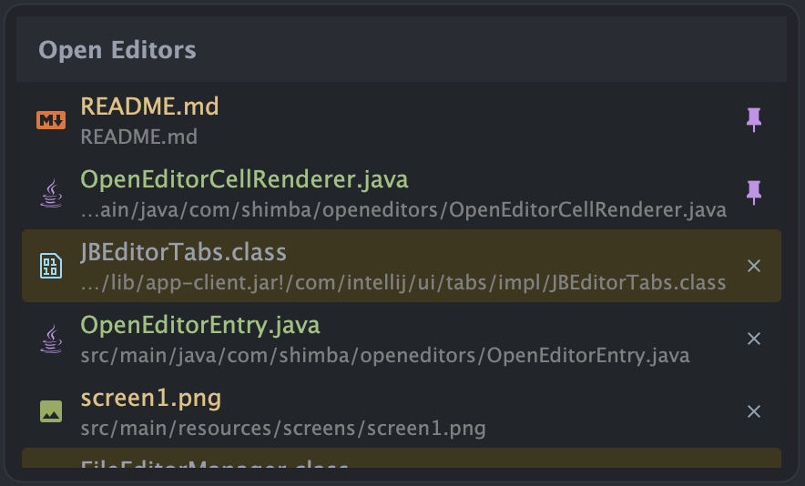

# Open Editors — Plugin for JetBrains IDEs

Shows currently open editor tabs in a persistent tool window panel, similar to VSCode's **Open Editors** view.

## Features

- **Persistent panel** — dockable tool window on the left side, always visible
- **Active file highlight** — the currently focused editor is highlighted automatically
- **Pinned tabs** — pinned files appear at the top with a pin icon; click the pin to unpin
- **Close button** — hover any file to reveal the close (×) button
- **Drag & drop reorder** — drag items to rearrange tab order within pinned or unpinned groups
- **File path display** — shows the relative project path below the file name; toggle via the gear menu
- **Context menu** — right-click any file to access the full editor tab context menu
- **Auto-scroll** — scrolls to keep the active file visible when switching tabs

## Screenshots

## Compatibility

Requires IntelliJ Platform 2025.1 or later (build 251+). Works with all JetBrains IDEs based on the IntelliJ Platform.
